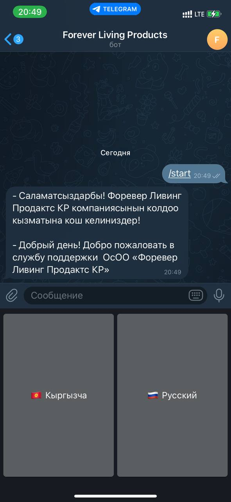
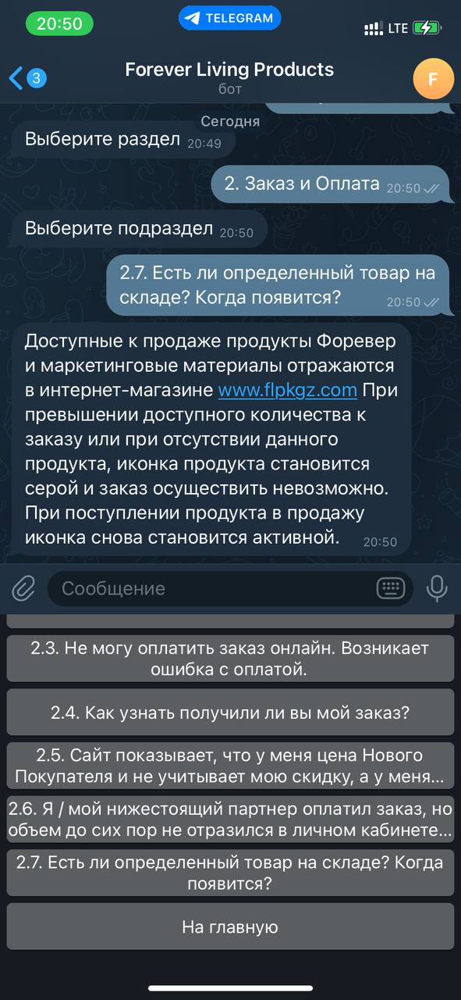

О проекте:
===
* У меня бот который парсит F.A.Q из сайта компании и отвечает на вопрос выбранный пользователем в меню кнопок. 
 
 
* Все модули можно установить через файл `requirement.txt` командой `pip install -r hw-7/requirements.txt`  
* Чтобы запустить бота вам необходимо создать бота в botfather. После создания бота вставьте токен внутрь кавычек в 
  файле `conifg.py`  

img:
---

